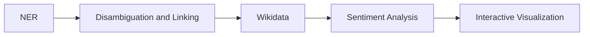

# Uncovering the Places of Love

In this report we will cover our DocAna'23 project. We will start by stating our [Problem Statement](#problem-statement), which contains a flowchart of the underlying problem. Next, we will explain our [Project Pipeline](#project-pipeline) containing the different steps during our project. Afterwards, we will take a closer look at the used [Models](#models), for Named Entity Recognition (NER), linking, disambiguation, and sentiment analysis. The last section is about the [Interactive Visualization](#interactive-visualization) and how we have used an emoji and choropleth map to show our results in terms of the relative distribution of the posts and conclude the report by stating the actions taken to connect different countries/cities with their respective sentiment analysis results.  

## Live Web Demo
You can try out our interactive visulization tool [HERE](https://mathisbeck.github.io/docana-deploy/).

## Problem Statement
The following diagram gives an overview of the different states during the project time.

 Figure 1: Setting up the problem statement and working along the line.  

The first step was performing a [NER](#ner) analysis with a pretrained model. This was done to filter relevant posts containing Geo Political Entities (GPE). The next step done by the model was to link every entity to a unique ID that corresponds to a Wikidata entry. This is relevant to distinguish between ambiguous GPEs (e.g., New York as a state and New York as a city) and get additional information about the GPEs from the Wikidata knowledge-base. We than used the metadata from Wikidata to filter the GPEs for countries and cities. Furhtermore, we also retrieved additional attributes such as population or geolocation. For some countries, e.g., Germany and the USA, we have also included filtering according to states. For the sentiment analysis we used a [multiclass model](#sentiment-analysis) which outputs the probability of 28 different sentiment labels, such as anger, sadness, love, ... .The last step was to visualize the three most dominant sentiments for each country, state (if applicable) and city in the underlying dataset using emojis. In addition, we also included a choropleth map that shows the relative distribution of the post occurrences. A more in depth explaination will be done in the following section.

## Project Pipeline
In this section, we will state the different stages of our project and how they are connected to each other.

### Database
For the database we decided to run a PostgreSQL server instance inside a Docker container. At the end the database should contain posts, metadata, sentiment as well as geographic data such as shapes of countries and locations of cities. The latter one has been realized by using the PostGIS plugin.

The next step was therefore to create a new table containig the Reddit posts themselfs, the results of the NER/linking as well as the results of the sentiment analysis. Furthermore we added the found Wikidata IDs of the entities found in the post (QID) and the sentiment classification of the post. Figure 2 shows the schema of the table and some example data. Running the [entity-fishing api](#ner) has been done in another Docker container.

 Figure 2: Snippet from the database with the QIDs and the related emotion for each post. 

### Processing the Reddit-data
For this project the data provided [here](https://huggingface.co/datasets/webis/tldr-17) has been used. The dataset consists of Reddit posts, collected until 2017. The total amount of posts adds up to roughly 4 million posts. For our analysis we looked at the content of each post provided in the ''normalizedBody'' attribute.

For reading the Reddit-data, we did a simple line by line approach, where each line corresponds to exactly one post. For running the entity-fishing model, we used a wrapper for spacy, which is configured to access the Docker container running the entity-fishing api. For each post the model than returns a list of entities and their associated labels (Person, GPE, ...) and QIDs. For furhter processing, only post that returned at least one GPE have been considered. These posts have than been stored in the database table mentioned above along with the QIDs of the found GPEs. To speed up the process, this step has been parallelized by running 16 workers at the same time. With this improvement we were able to proceed roughly 70% of the whole dataset. However, the speed of the process at this point has been slowed down drastically (even without the paraliliazation), which was probably due to the fast growing rate of the databse and therefore running out of RAM. Running the entity-fishing model and the database in Docker containers at the same time required a lot of RAM. The porcessing was peformed on a machine with 16GB of RAM.

For every post in the database we run them through the sentiment model and stored the results also in the posts database table. A more detailed explanation of the model can be found [here](#sentiment-analysis).

### Create a table to store metadata about the founded GPEs
To store metadata about the found GPEs we created another table that containes the name of the GPE, the type (city, country or state) as well as the border shape for countries and states or the center point for cities. For an example, see Figure 3.

 Figure 3: Snippet from the database containing the metadata. 

### Annotate and filter all found GPEs with metadata
To retrieven the metadata of the found GPEs, we queried the Wikidata knowledge-base via the SPARQL endpoint for every GPE. While doing so, we inspected the 'instanceOf' predicate to classify the GPE. This was done to distinguish between city, state or country and to check if there maybe was a misclassificatioin by the model. This step was not as easy as we first thought, since the data in the Wikidata knowledge-base is quite heterogenous. E.g., to classify a GPE as a city we ended up including all of the following values for the 'instanceOf' predicate:

'city', 'big city', 'million city', 'largest city', 'cycling city', 'city or town', 'capital city', 'component city', 'city in Ukraine', 'megacity'. 

This whole process was also necessary to get additional metadata such as the population, country code, shape for state, and center for cities. Because of inconsistencies, the shapes of the countries have not been extracted from Wikidata, but rather using a dataset from [this](https://public.opendatasoft.com/explore/dataset/world-administrative-boundaries/export/) page. We combined the two data sources unsing the country code and inserted the whole data into the table.

### Aggregate emotions
For each GPE in the database we have looked up all the posts containing this GPE. The next step was then to average over the sentiment of all matching posts and storing the resulting averages in the GPEs table in the database.

   

### Setup Backend
The backend was set up using Python in combination with fastAPI. It queries the necessary data from the database and sends it to the frontend. One endpoint is used for getting the average sentiment of either countries, states or cities and another endpoint for counting the number of posts for every country/state and returning the distribution.

## Models
For our analysis we have used two differnt machine learning models, namely a NER and a sentiment analysis model.

### NER, linking and disambiguation
The used [model](https://github.com/Lucaterre/spacyfishing) is the enitiy-fishing model from Patrice Lopez. We used a available wrapper for spacy to include it in our code. It is used for general entity recognition and disambiguation against Wikidata. The [documentation](https://nerd.readthedocs.io/en/latest/overview.html) gives a more in depth explanation on how this model works.

### Sentiment analysis
For our sentiment analysis we have used the [_roberta-base-go_emotions_](https://huggingface.co/SamLowe/roberta-base-go_emotions) model. This model is a multicalss sentiment analysis model based on Reddit data and gives 28 'probability' float outputs for any given input text.

## Interactive Visualization
The interactive visualization can be found [here](https://mathisbeck.github.io/docana-deploy/). The frontend was build using Angular and the map realization was done via Leaflet. There are two views: distribution (see Figure 4) and sentiment (see Figure 5). The distribution view contains a choropleth map and the sentiment view maps each emotion to an emoji and displays the top three on the map. The user can select a granularity level of either country, city, or state. Becuase the dstribution of the posts is quite skewed, we also included the option for a logarithmic color scale on the choropleth map as well as the posibilitiy to nomalize the ditribution by population. In the sentiment view the user can hide the 'neutral' sentiment emojies because they are very dominant.

 Figure 4: Distribution view. 

 Figure 5: Sentiment view. 

