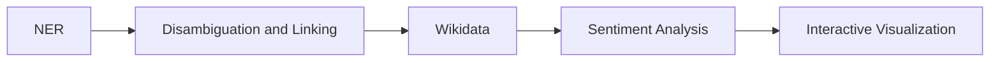

# Uncovering the Places of Love

In this report we will cover the DocAna'23 project. We will start by our [Problem Statement](#problem-statement), which contains a flowchart of the underlying problem. Next, we will explain our [Project Pipeline](#project-pipeline) containing the different steps during our project. Afterwards, we will take a closer look at the used [Models](#models), namely the models for Named Entity Recognition (NER) and sentiment analysis. The last section will be about the [Interactive Visualization](#interactive-visualization) and how we have used a choropleth map to show our results in terms of the relative distribution of the posts and conclude the report by stating the actions taken to connect different countries/cities with their respective sentiment analysis results.  

## Problem Statement
The following diagram gives an overview of the different states during the project time.

 Figure 1: Setting up the problem statement and working along the line.  

The first step was performing a [NER](#ner) analysis with a pretrained model. This was done to filter relevant posts containing Geo Political Entities (GPE). The next step was to link every entity to a unique ID that corresponds to a wikidata entry. This is relevant to distinguish between states and cities (e.g., New York). We than used metadat from wikidata to filter the GPEs for countries and cities. Furhtermore, we also retrieved additional metadata such as population or geolocation. For some countries, e.g., Germany and the USA, we have also included filtering according to states. For the sentiment analysis we used a [multiclass model](#sentiment-analysis), which outputs the probability of 28 different sentiment labels, such as anger, sadness, love, ... . The last step was to visualize the relative distribution of the post-occurrences using a choropleth map. In addition, we also included the three most dominant sentiment for each country, state (if applicable) and city in the underlying dataset using emojis. A more in depth explaination will be done in the following section. 

## Project Pipeline
In this section, we will state the different stages of our project and how they are connected to each other. 

### Database
For the database we decided to use PostgreSQL inside a Docker container. At the end the database should contain posts, metadata, sentiment as well as geographic data such as shapes of countries and locations of cities. The latter one has been realized by using the PostGIS plugin.

The next step was therefore to create a (new) table which also includes the results of the NER/linking as well as the results of the sentiment analysis. Furthermore we added the found wikidata IDs of the entities found in the post (QID) and the sentiment classification of the post. For an example view Figure 2. Running the [entity-fishing api](#ner) has been done in another docker container.

 Figure 2: Snippet from the database with the QIDs and the related emotion for each post. 

### Processing the Reddit-data
For this project the data provided [here](https://huggingface.co/datasets/webis/tldr-17) has been used. The dataset consists of reddit posts, collected until 2017. The total amount of posts adds up to roughly 4 million posts. For our analysis we lokked at the content (string) of each post.

For reading the reddit-data, we did a simple line by line approach, where each line corresponds to exactly one post. For running the entity-fishing, we used the ''normalizedBody'' and a spacy wrapper, which is configured to access the docker container. The model than returns a list of entities and their associated labels (Person, GPE, ...) and the QID. For furhter processing, only post that returned at least one GPE has been considered. These post has than been stored along with the QIDs of the found GPEs. This step has been parallelized by running 16 workers at the same time. With this improvement we were able to proceed roughly 70% of the whole dataset. However, the speed of the process at this point has been slowed down quite a bit, which was probably due to the fast growing rate of the databse and therefore running out of RAM. In addition, running the entity-fishing model and the database in docker at the same time also required a lot of RAM.  

For every post in the database we run them through the sentiment model and stored the results also in the posts database table. A more detailed explanation of the model can be found [here](#sentiment-analysis). 

### Create a table to store metadata about the founded GPEs
The table containes the name of the GPE, the type (city, country or state) as well as the border shape for countries and states or the center point for cities. For an example, see figure 3

 Figure 3: Snippet from the database containing the metadata. 

### Annotate and filter all found GPEs with metadata
To link the found GPEs to the wikidata knowlede base, we query the latter one with the SPARQL endpoint for every GPE. While doing so, we also checked the 'instanceOf' attribute to classify the GPE. This was done to distinguish between city, state or country and to check if there maybe was a misclassificatioin by the model. This step was not as easy at it might seem, since the wikidata is quite heterogenous, which can be seen by looking at the 'instanceOf' attribute for cities: 

'city', 'big city', 'million city', 'largest city', 'cycling city', 'city or town','capital city', 'component city', 'city in Ukraine','megacity'. This whole process was also necessary to get additional metadata such as: population, country_code, shape for state, center for cities. The shape of the countries has not been extracted from the wikidata, but rather from [this](https://public.opendatasoft.com/explore/dataset/world-administrative-boundaries/export/) page. We than matched this with the country code and inserted the whole data into the table. 

### Aggregate emotions
For each GPE in the database we have looked up all the posts containing this GPE. The next step was than to average over the sentiment of all matching posts and storing the resulting averages in the gpes table in the database. 

   

### Setup Backend
The backend was set up usig Python in combination with fastAPI. The workflow is as follows: querying the data from the database and sending it to the frontend. One endpoint is used for getting the average sentiment of either countries, states or cities and another endpoint for counting the number of posts for every country/state and returning the distribution. 

## Models
For our analysis we have used two differnt models, namely a NER and a sentiment analysis model. 

### NER
The used [Model](https://github.com/Lucaterre/spacyfishing) is spaCy fishing model, which is used for general entity recognition and disambiguation against Wikidata. The [documentation](https://nerd.readthedocs.io/en/latest/overview.html) gives a more in depth explanation on how this model works. 

### Sentiment analysis
For our sentiment analysis we have used the [_roberta-base-go_emotions_](https://huggingface.co/SamLowe/roberta-base-go_emotions) model. This model is a multicalss sentiment analysis model based on Reddit data and gives 28 'probability' float outputs for any given input text. 

## Interactive Visualization
The interactive visualization can be found [her](https://mathisbeck.github.io/docana-deploy/). The frontend was build using angular and the map realization was done via leaflet. There are two views: distribution (see Figure 4) and sentiment (see Figure 5). The distribution view contains a choropleth map and the sentiment view maps each emotion to an emoji and displays only the top three on the map. 

 Figure 4: Distribution view. 

 Figure 5: Sentiment view. 

