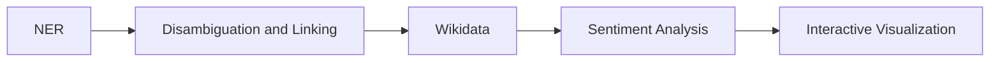

# Uncovering the Places of Love

In this report we will discuss our DocAna'23 project. We will start by explaining our [Problem Statement](#problem-statement), which includes a flowchart of the underlying problem. Next, we will explain our [Project Pipeline](#project-pipeline) containing the different steps during our project. After that, we will take a closer look at the used [Models](#models) used for Named Entity Recognition (NER), linking, disambiguation, and sentiment analysis. The last section is about the [Interactive Visualization](#interactive-visualization) and how we have used an emoji and choropleth map to show our results in terms of the relative distribution of the posts and we conclude the report by stating the actions taken to link different countries/cities with their respective sentiment analysis results.  

## Live Web Demo
You can try out our interactive visualization tool [HERE](https://mathisbeck.github.io/docana-deploy/).

## Problem Statement
The following diagram gives an overview of the different states of the project.

 Figure 1: Setting up the problem statement and working along the line.  

The first step was to perform a [NER](#ner) analysis using a pre-trained model. This was done to filter out relevant posts containing Geo Political Entities (GPE). The next step performed by the model was to link every entity with a unique ID that corresponds to a Wikidata entry. This is important to distinguish between ambiguous GPEs (e.g., New York as a state and New York as a city) and to obtain information about the GPEs from the Wikidata knowledge-base. We then used the metadata from Wikidata to filter the GPEs for countries and cities. We also retrieved additional attributes such as population or geolocation. For some countries, such as Germany and the USA, we also filtered by state. For the sentiment analysis we used a [multiclass model](#sentiment-analysis) that outputs the probability of 28 different sentiment labels, such as anger, sadness, love, ... .The last step was to visualize the three most dominant sentiments for each country, state (if applicable) and city in the underlying dataset using emoji. In addition, we also included a choropleth map showing the relative distribution of the post occurrences. A more detailed explaination is provided in the following section.

## Project Pipeline
In this section, we will explain the different stages of our project and how they are connected to each other.

### Database
For the database we decided to run a PostgreSQL server instance inside a Docker container. At the end the database should contain posts, metadata, sentiment as well as geographic data such as shapes of countries and locations of cities. The latter was realized by using the PostGIS plugin.

The next step was to create a new table containing the Reddit posts themselves, the results of the NER/linking, and the results of the sentiment analysis. We also added the Wikidata IDs of the entities found in the post (QID) and the sentiment classification of the post. Figure 2 shows the schema of the table and some example data. Running the [entity-fishing api](#ner) has been done in another Docker container.

 Figure 2: Snippet from the database showing the QIDs and associated emotion for each post. 

### Processing the Reddit-data
For this project we used the data provided [here](https://huggingface.co/datasets/webis/tldr-17). The dataset consists of Reddit posts, collected until 2017. The total number of posts is about 4 million. For our analysis, we looked at the content of each post, provided in the ''normalizedBody'' attribute.

To read the Reddit data, we took a simple line-by-line approach, where each line corresponds to exactly one post. To run the entity-fishing model, we used a wrapper for spaCy, which is configured to access the Docker container running the entity-fishing api. For each post, the model returns a list of entities and their associated labels (person, GPE, ...) and QIDs. For further processing, only posts that returned at least one GPE were considered. These posts were then stored in the database table mentioned above, along with the QIDs of the GPEs found. To speed up the process, this step was parallelized by running 16 workers simultaneously. With this improvement, we were able to process about 70% of the entire dataset. However, the speed of the process slowed down drastically at this point (even without parallelization), which was probably due to the fast growth rate of the database and the resulting lack of RAM. Running the entity fishing model and the database in Docker containers at the same time required a lot of RAM. The processing was done on a machine with 16 GB of RAM.

For each post in the database, we ran it through the sentiment model and stored the results in the posts database table as well. A more detailed explanation of the model can be found [here](#sentiment-analysis).

### Create a table to store metadata about the founded GPEs
To store metadata about the GPEs found, we created another table that contains the name of the GPE, the type (city, country, or state), and the shape of the boundary for countries and states or the center for cities. See Figure 3 for an example.

 Figure 3: Snippet from the database containing the metadata. 

### Annotating and Filtering All Found GPEs with Metadata
To retrieve the metadata of the GPEs found, we queried the Wikidata knowledge base via the SPARQL endpoint for each GPE. In doing so, we checked the 'instanceOf' predicate to classify the GPE. This was done to distinguish between city, state or country and to check if there was a possible misclassification by the model. This step was not as easy as we first thought because the data in the Wikidata knowledge base is quite heterogeneous. For example, to classify a GPE as a city, we ended up including all of the following values for the 'instanceOf' predicate:

'city', 'big city', 'million city', 'largest city', 'cycling city', 'city or town', 'capital city', 'component city', 'city in Ukraine', 'megacity'. 

This whole process was also necessary to obtain additional metadata such as the population, country code, shape for states, and center for cities. Due to inconsistencies, the shapes of the countries were not extracted from Wikidata, but rather using a dataset from [this](https://public.opendatasoft.com/explore/dataset/world-administrative-boundaries/export/) page. We combined the two data sources unsing the country code and inserted the whole data into the table.

### Aggregate emotions
For each GPE in the database we have looked up all the posts containing this GPE. The next step was then to average over the sentiment of all matching posts and storing the resulting averages in the GPEs table in the database.

   

### Setup Backend
The backend was built using Python in combination with fastAPI. It retrieves the necessary data from the database and sends it to the frontend. One endpoint is used to get the average sentiment of either countries, states or cities and another endpoint is used to count the number of posts for each country/state and return the distribution.

## Models
For our analysis we have used two different machine learning models, namely a NER and a sentiment analysis model.

### NER, linking and disambiguation
The [model](https://github.com/Lucaterre/spacyfishing) we used is Patrice Lopez's enitiy-fishing model. We used an available wrapper for spaCy to include it in our code. It is used for general entity recognition and disambiguation against Wikidata. See the [documentation](https://nerd.readthedocs.io/en/latest/overview.html) 
for a more detailed explanation of how this model works.

### Sentiment analysis
For our sentiment analysis we have used the [_roberta-base-go_emotions_](https://huggingface.co/SamLowe/roberta-base-go_emotions) model. This model is a multicalss sentiment analysis model based on Reddit data and gives 28 'probability' float outputs for any given input text.

## Interactive Visualization
The interactive visualization can be found [here](https://mathisbeck.github.io/docana-deploy/). The frontend was built using Angular and the map realization was done using Leaflet. There are two views: distribution (see Figure 4) and sentiment (see Figure 5). The distribution view contains a choropleth map and the sentiment view maps each emotion to an emoji and displays the top three on the map. The user can select a granularity level of either country, city, or state. Since the distribution of posts is quite skewed, we also added the option for a logarithmic color scale on the choropleth map, as well as the ability to normalize the distribution by population. In the sentiment view, the user can hide the 'neutral' sentiment emoji because they are very dominant.

 Figure 4: Distribution view. 

 Figure 5: Sentiment view. 

