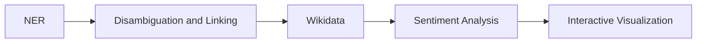

# Uncovering the Places of Love

In this report we will cover the DocAna'23 project. We will start by explaining the [Data](#data),especially which data has been used and the steps of the data processing. Next, we will state our [Problem Statement](#problem-statement), which contains a flowchart of the underlying problem. Afterwards, we will take a closer look at the used [Models](#models), namely the models for Named Entity Recognition (NER) and sentiment analysis. The last section will be about the [Interactive Visualization](#interactive-visualization) and how we have used a choropleth map to show our results in terms of the relative distribution of the posts and conclude the report by stating the actions taken to connect different countries/cities with their respective sentiment analysis results.  

## Problem Statement
The following diagram gives an overview of the different states during the project time. 

 Figure 1: Different  

The first step was performing a [NER](#ner) analysis with a pretrained model. This was done to filter relevant posts containing Geo Political Entities (GPE). The next step was to link every entity to a unique ID that corresponds to a wikidata entry. This is relevant to distinguish between states and cities (e.g., New York). We than used metadat from wikidata to filter the GPEs for countries and cities. Furhtermore, we also retrieved additional metadata such as population or geolocation. For some countries, e.g., Germany and the USA, we have also included filtering according to states. For the sentiment analysis we used a [multiclass model](#sentiment-analysis), which outputs the probability of 28 different sentiment labels, such as anger, sadness, love, ... . The last step was to visualize the relative distribution of the post-occurrences using a choropleth map. In addition, we also included the three most dominant sentiment for each country, state (if applicable) and city in the underlying dataset using emojis.  

## Project Pipeline

### ???

For the Database we decided to use PostgreSQL inside a Docker container. At the end the database should contain posts, metadata, sentiment as well as geographic data such as shapes of countries and locations of cities. The latter one has been realized by using the PostGIS plugin.

The next step was therefore to create a (new) table which also includes the results of the NER/linking as well as the results of the sentiment analysis. Furthermore we added the found wikidata IDs of the entities found in the post (QID) and the sentiment classification of the post. For an example view . Running the [entity-fishing api](#ner) has been done in another docker container.

 

4. Read the reddit-data
   - line by line, each line is one post
   - use the 'normalizedBody' to run the entity-fishing model for each post
     - using a spacy wrapper that is configured to access the docker container
   - the model returns a list of entities with their labels (Person, GPE, ...) and QID
   - only further consider posts that return at least one GPE
   - store these posts in the database along with the QIDs of the found GPEs
   - we parallelized this step by running 16 workers at the same time
   - this way we processed about 70% of the dataset
   - however the process slowed has down a lot a at this point
     - probably because the database grew too large and we ran out of ram
     - running the database and the entity-fishing model in docker at the same time requires a lot of ram

5. Run sentiment analysis
   - For every post in the database (only the ones that contain a GPE)
   - Run them through the sentiment model
   - Store the results also in the posts database table

6. Create a table to store metadata about the found GPEs
   - contains the name of the GPE,
   - the type (city, country or state),
   - the border shape for countries&states / center point for cities
   

7. Annotate and filter all found GPEs with metadata
   - Query the wikidata knowledge base with the SPARQL endpoint for every GPE
   - check the 'instanceOf' attribute to classify the GPE
     - city, state or country
     - or it has been misclassified by the model and is something different
     - difficult because data is heterogeneous
     - e.g. used values for the 'instanceOf' attribute for cities ['city', 'big city', 'million city', 'largest city', 'cycling city', 'city or town','capital city', 'component city', 'city in Ukraine','megacity']
   - get additionally metadata: population, country_code, shape for state, center for cities
   - the shapes for countries is not from wikidata but from [here](https://public.opendatasoft.com/explore/dataset/world-administrative-boundaries/export/)
      - matched with the country code
   - the data is inserted into the table

8. Aggregate emotions
   - For each GPE in the database look up all the posts that contain this GPE
   - Average the sentiments for all the matching posts
   - Store the resulting average in the gpes table in the database

9. Setup Backend
   - Python backend using fastAPI
   - Queries the data from the database and sends it to the frontend
   - One endpoint for getting the averaged sentiment of either countries, cities, or state
   - Another endpoint for counting the number of post for every country/state and returning the distribution

10. Frontend
    - Build using angular
    - The map is realized via leaflet
    - The views: distribution, sentiment
      - Distribution: Coropleth map
      - Sentiemnt: Each emotion is mapped to a emoji. Top three are displayed on map

## Data!!!
For this project the data provided [here](https://huggingface.co/datasets/webis/tldr-17) has been used. The dataset consists of reddit posts, collected until 2017. The total amount of posts adds up to roughly 4 million posts. For our analysis we lokked at the content (string) of each post. 

## Models
For our analysis we have used two differnt models, namely:

### NER
[Model](https://github.com/Lucaterre/spacyfishing) and the [documentation](https://nerd.readthedocs.io/en/latest/overview.html)

### Sentiment analysis
For our sentiment analysis we have used the [_roberta-base-go_emotions_](https://huggingface.co/SamLowe/roberta-base-go_emotions) model. This model is a multicalss sentiment analysis model

## Interactive Visualization
The interactive visualization can be found [her](https://mathisbeck.github.io/docana-deploy/)

Lorem ipsum dolor sit amet, consetetur sadipscing elitr, sed diam nonumy eirmod tempor invidunt ut labore et dolore magna aliquyam erat, sed diam voluptua. At vero eos et accusam et justo duo dolores et ea rebum. Stet clita kasd gubergren, no sea takimata sanctus est Lorem ipsum dolor sit amet. Lorem ipsum dolor sit amet, consetetur sadipscing elitr, sed diam nonumy eirmod tempor invidunt ut labore et dolore magna aliquyam erat, sed diam voluptua. At vero eos et accusam et justo duo dolores et ea rebum. Stet clita kasd gubergren, no sea takimata sanctus est Lorem ipsum dolor sit amet.